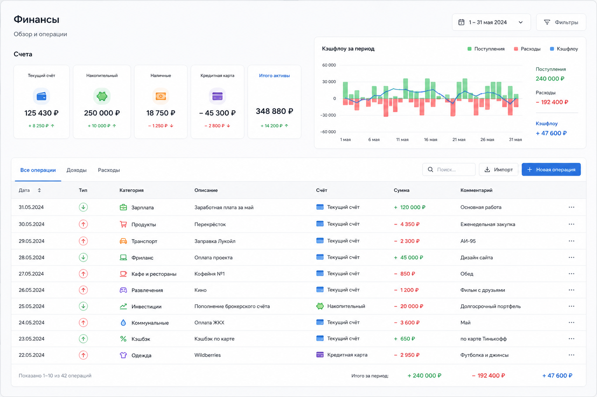
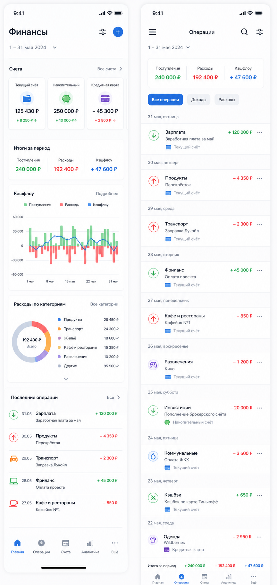

# PFinance: UI reference

Этот документ фиксирует направление интерфейса, согласованное в диалоге по проекту. Он не является готовым макетом: детали могут уточняться на этапе проектирования.

## Визуальные референсы

Исходные изображения сохранены в репозитории и являются визуальным ориентиром для компоновки, плотности информации и иерархии экранов. Они не расширяют согласованный состав MVP и не заменяют продуктовые правила остальных документов.

### Единственный актуальный эталон PFinance v2

#### Desktop

Файл: [`docs/references/pfinance-v2-desktop-reference.png`](references/pfinance-v2-desktop-reference.png)

#### Mobile

Файл: [`docs/references/pfinance-v2-mobile-reference.png`](references/pfinance-v2-mobile-reference.png)

Эти два файла являются единственным актуальным визуальным эталоном интерфейса PFinance: desktop-композиция определяется desktop-изображением, mobile-композиция — mobile-изображением. При любых расхождениях между текстовым описанием и изображениями приоритет имеют изображения.

Предыдущий эталон CH Finance и более ранние изображения в `docs/references/` сохраняются только как архив истории проекта. Они больше не используются для принятия визуальных решений и сравнений.

Новый эталон заменяет прежнее правило о приоритете mobile-first только в части визуального воспроизведения: каждый viewport сверяется со своим утверждённым изображением.

## Цель интерфейса

PFinance заменяет Excel-таблицу для семейного учёта финансов. Интерфейс должен оставаться проще таблицы, а не переносить её сложность в новую форму.

Главный пользовательский цикл:

1. Быстро добавить операцию.
2. Сразу увидеть обновлённое состояние финансов.

## Основной сценарий

Телефон — основное устройство. Приложение должно быть удобно для ежедневного использования одной рукой. Десктопная версия адаптирует тот же сценарий, но не диктует структуру мобильного интерфейса.

Для добавления операции нужны только поля, влияющие на учёт:

- дата;
- тип: доход, расход или перевод;
- счёт;
- категория;
- сумма;
- необязательный комментарий.

Вместо свободного ручного ввода нужно использовать понятные списки и крупные touch-targets, где это ускоряет ввод.

## Информационная архитектура

Концепция предполагает четыре понятных раздела:

### 1. Главная

Краткая сводка, отвечающая на главные вопросы:

- общий баланс;
- баланс каждого счёта;
- доходы и расходы за месяц;
- cash flow;
- остатки бюджета по категориям;
- последние операции.

### 2. Операции

Единственное место для повседневного ввода. В списке не нужно показывать расчётный баланс после каждой строки: на телефоне это перегружает интерфейс.

### 3. Бюджет

Пользователь задаёт лимиты по категориям и видит их исполнение:

- лимит;
- потрачено;
- остаток;
- доля использованного бюджета.

Потраченное и остаток рассчитываются автоматически из операций. Пользователь не должен дублировать ввод расходов в этом разделе.

### 4. Настройки

Согласованные параметры приложения. В раздел не нужно добавлять настройки «на будущее».

Планируемые платежи и прогноз остатка могут быть добавлены только после отдельного согласования.

## Визуальные принципы

- Desktop использует полноширинную композицию без постоянного sidebar. Основной контент ограничивается максимальной шириной конкретного сценария и центрируется.
- Mobile использует фиксированную нижнюю навигацию из пяти пунктов: Главная, Операции, Счета, Аналитика и Ещё.
- Основной акцентный цвет — синий. Зелёный обозначает доход или положительное значение, красный — расход или отрицательное значение.
- Основные карточки используют белый фон, тонкую светло-серую границу, радиус 8–12 px и минимальную тень.
- Основные кнопки имеют высоту 40–44 px; поля форм — 46 px. Видимый focus обязателен для интерактивных элементов.
- Desktop-страницы используют боковые отступы около 30 px, mobile — 18 px. Заголовки экранов и формы должны сохранять эту систему.
- На mobile финансовые списки группируются и уплотняются без горизонтальной прокрутки; широкие desktop-таблицы заменяются карточными строками.
- Приоритет — читаемость сумм, понятные подписи и быстрый ввод.
- Доход, расход и перевод могут различаться цветом, но смысл не должен зависеть только от цвета.
- Графики и сложная аналитика не являются целью первой версии.
- На каждом экране должна быть одна основная задача.
- Большие суммы и ключевые действия видны без масштабирования и горизонтальной прокрутки.

## Критерии простоты

Перед добавлением элемента или экрана нужно ответить:

1. Помогает ли это быстрее добавить операцию?
2. Помогает ли это понять текущее состояние финансов?
3. Можно ли достичь той же цели более простым способом?

Если элемент не проходит эту проверку, его не нужно добавлять.
